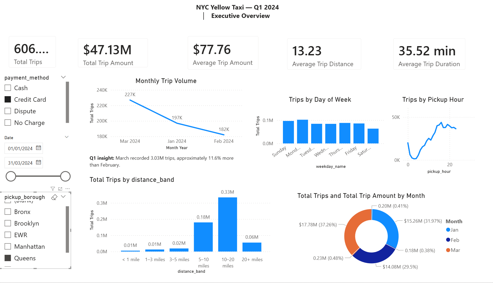
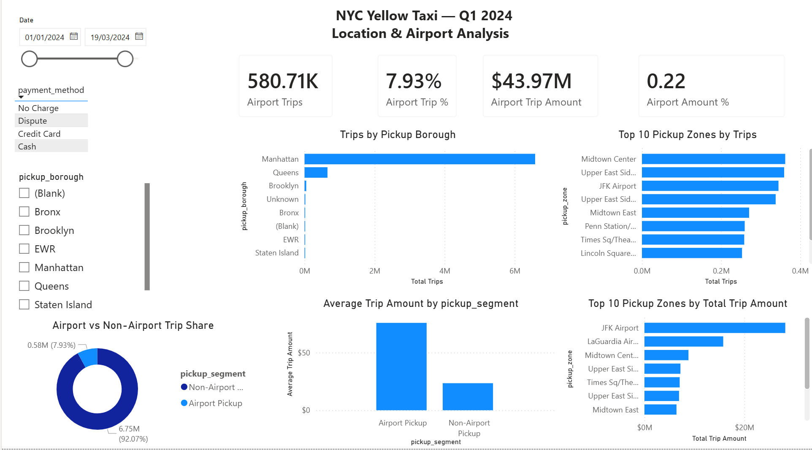

# NYC Yellow Taxi Analytics | PostgreSQL, Python & Power BI

An end-to-end data analytics portfolio project analysing **8.47 million NYC Yellow Taxi trips from Q1 2024** using Python, PostgreSQL, SQL and Power BI.

The project demonstrates a complete analytical workflow: raw Parquet ingestion, data-quality assessment, SQL cleaning, anomaly investigation, feature engineering, geographic enrichment, business analysis and interactive dashboard development.

---

## Project Overview

The objective was to transform large-scale NYC Yellow Taxi trip data into a reliable analytical dataset and answer practical questions about:

- trip demand and seasonality
- peak travel periods
- geographic concentration
- trip distance patterns
- payment behaviour
- airport activity
- trip-value differences across locations

Rather than analysing the raw files directly in Power BI, I built a layered PostgreSQL pipeline and exposed a curated reporting view to the dashboard.

---

## Technology Stack

- **Python** — pandas, PyArrow
- **PostgreSQL** — data storage, transformation and analysis
- **SQLAlchemy / psycopg2** — Python-to-PostgreSQL connectivity
- **SQL** — profiling, cleaning, feature engineering, anomaly analysis and business analysis
- **Power BI** — data modelling, DAX and dashboard visualisation
- **Power Query** — final data-type preparation
- **Git / GitHub** — version control and portfolio presentation

---

## Data Pipeline

```text
NYC TLC Parquet Files
        ↓
Python / pandas
        ↓
PostgreSQL Raw Layer
        ↓
Data Profiling & Quality Checks
        ↓
Clean Analytical Layer
        ↓
Feature Engineering
        ↓
Anomaly Investigation
        ↓
Q1 2024 Dashboard Population
        ↓
NYC Taxi Zone Enrichment
        ↓
Business Analysis
        ↓
Power BI Reporting View
        ↓
Power BI Dashboard
```

Python was used to read the source Parquet files and load them into PostgreSQL.

Core ingestion pattern:

```python
pd.read_parquet()
    → create_engine()
    → df.to_sql()
```

The raw database layer was preserved before downstream SQL transformations.

---

## Data Quality & Cleaning

The project included explicit checks for:

- missing essential fields
- non-positive trip distances
- invalid pickup/drop-off sequences
- non-positive total trip amounts
- implausible passenger counts
- potential duplicate records
- extreme trip durations
- implausible implied speeds
- extreme tip values
- unmatched taxi-zone identifiers
- records outside the intended Q1 2024 reporting period

The core clean layer retained trips where:

- required analytical fields were present
- `trip_distance > 0`
- drop-off occurred after pickup
- `total_amount > 0`
- passenger count was between 1 and 6

Extreme observations were investigated separately rather than indiscriminately deleting all statistical outliers.

For the reporting population, trips with:

- implied speed above **100 mph**, or
- duration above **240 minutes**

were excluded.

Extreme tips above **$100** were retained with an anomaly flag so that tip-specific measures could handle them separately.

The final dashboard dataset was explicitly restricted to:

```sql
tpep_pickup_datetime >= '2024-01-01'
AND tpep_pickup_datetime < '2024-04-01'
```

This produced a final Q1 2024 reporting population of:

**8,472,028 trips**

---

## Feature Engineering

SQL was used to create reusable analytical features including:

- trip duration in minutes
- implied average speed
- trip date
- pickup hour
- day of week
- weekday name
- weekday/weekend classification
- payment-method labels
- distance bands
- airport/non-airport segmentation

The NYC Taxi Zone lookup was joined twice to provide both:

- pickup borough and zone
- drop-off borough and zone

Lookup uniqueness and unmatched LocationIDs were validated before the geographic enrichment was used for reporting.

---

## Key Business Findings

### Q1 Executive KPIs

| Metric | Result |
|---|---:|
| Total Trips | 8,472,028 |
| Total Trip Amount | ~$234.88M |
| Average Trip Amount | ~$27.72 |
| Average Trip Distance | ~3.30 miles |
| Average Trip Duration | ~15.47 minutes |

> **Note:** `total_amount` is described as **Total Trip Amount / Recorded Trip Amount**, not company revenue.

### Demand Patterns

Trip volume increased to approximately **3.03 million trips in March**, compared with approximately **2.72 million** in both January and February.

**Thursday** recorded the highest overall trip volume.

Demand peaked around **18:00**, with approximately **610,640 trips** during that pickup hour across Q1.

### Distance Behaviour

Approximately **73.28% of trips were under three miles**.

This shows that NYC Yellow Taxi activity was dominated by relatively short urban journeys, although longer-distance trips generated substantially higher average trip amounts.

### Geographic Concentration

**Manhattan dominated overall pickup volume**, while Queens produced a much higher average trip amount because of its airport activity.

High-volume pickup zones included:

- Midtown Center
- Upper East Side South
- JFK Airport
- Upper East Side North
- Midtown East
- Times Square/Theatre District
- Penn Station/Madison Square West
- Lincoln Square East
- LaGuardia Airport

### Airport Economics

Airport pickups represented only approximately:

**8.01% of trips**

but generated approximately:

**21.94% of Total Trip Amount**

Average Trip Amount:

- **Airport Pickup:** ~$75.93
- **Non-Airport Pickup:** ~$23.53

Airport trips therefore generated an average recorded trip amount more than three times that of non-airport trips.

JFK Airport alone recorded approximately **403,906 trips** and **$33.09M Total Trip Amount**.

This demonstrates an important analytical distinction:

> **High trip volume does not necessarily mean high trip value.**

### Payment Behaviour

Credit cards represented approximately **83.9% of trips**, while cash represented approximately **14.9%**.

Recorded `tip_amount` should be interpreted carefully because cash tips are generally not represented in the same way as card tips in the TLC dataset. Therefore, the project does not interpret zero recorded cash tips as evidence that cash passengers do not tip.

---

## Power BI Dashboard

The final Power BI model connects to a curated PostgreSQL reporting view containing **25 reporting fields** rather than the full development dataset.

### Executive Overview



The Executive Overview presents:

- Total Trips
- Total Trip Amount
- Average Trip Amount
- Average Trip Distance
- Average Trip Duration
- monthly trip trend
- weekday demand
- hourly demand
- distance-band distribution
- interactive date, payment and borough filters

### Location & Airport Analysis



The second page focuses on:

- pickup borough performance
- top pickup zones by trip volume
- top pickup zones by Total Trip Amount
- airport vs non-airport trip share
- airport vs non-airport Average Trip Amount
- airport contribution to Total Trip Amount

---

## SQL Structure

The recruiter-facing SQL workflow is organised into seven scripts:

```text
sql/
├── 01_data_profiling.sql
├── 02_data_quality_checks.sql
├── 03_cleaning_and_features.sql
├── 04_anomaly_analysis.sql
├── 05_zone_enrichment.sql
├── 06_business_analysis.sql
└── 07_powerbi_reporting.sql
```

### 01 — Data Profiling

Examines dataset size, date coverage, schema, completeness, cardinality and numerical ranges.

### 02 — Data Quality Checks

Tests NULLs, invalid timestamps, non-positive values, passenger counts, potential duplicates and monetary consistency.

### 03 — Cleaning & Feature Engineering

Creates the clean analytical table, validates cleaning rules, adds indexes and generates reusable analytical features.

### 04 — Anomaly Analysis

Investigates extreme distance, duration and monetary observations and creates explicit anomaly flags.

### 05 — Zone Enrichment

Validates the NYC Taxi Zone lookup and enriches trips with pickup/drop-off borough and zone information.

### 06 — Business Analysis

Answers business questions relating to demand, time, geography, payment methods, distance and airport performance.

### 07 — Power BI Reporting

Creates readable analytical dimensions and the final streamlined reporting view consumed by Power BI.

---

## Repository Structure

```text
nyc_taxi_project/
│
├── README.md
├── .gitignore
│
├── dashboard/
│   ├── executive_overview.png
│   └── location_airport_analysis.png
│
├── data/
│   └── taxi_zone_lookup.csv
│
├── python/
│   ├── load_data.py
│   └── load_zone_lookup.py
│
├── sql/
│   ├── 01_data_profiling.sql
│   ├── 02_data_quality_checks.sql
│   ├── 03_cleaning_and_features.sql
│   ├── 04_anomaly_analysis.sql
│   ├── 05_zone_enrichment.sql
│   ├── 06_business_analysis.sql
│   ├── 07_powerbi_reporting.sql
│    
│
└── docs/
```

Large raw Parquet files are intentionally excluded from version control.

---

## Environment Setup

Install the required Python libraries:

```bash
pip install pandas pyarrow sqlalchemy psycopg2-binary
```

The project uses PostgreSQL as the analytical database.

The source Parquet files are loaded into the raw database layer with Python/pandas before the SQL pipeline is executed.

---

## Analytical Design

A key principle of this project was **separation of responsibilities**.

The raw source data remains separate from:

1. cleaned data
2. engineered analytical features
3. anomaly logic
4. geographic enrichment
5. business-facing dimensions
6. the final BI reporting layer

This makes the workflow easier to validate, debug and explain than performing all transformations directly inside the dashboard.

---

## Skills Demonstrated

**SQL:** PostgreSQL, CTE-style analytical logic, CASE expressions, aggregations, window functions, percentile analysis, views, joins, indexing and data-quality validation

**Data Engineering:** Parquet ingestion, Python-to-PostgreSQL loading, layered transformations and reporting-view design

**Data Analysis:** profiling, anomaly investigation, segmentation, KPI analysis, temporal analysis and geographic analysis

**Power BI:** data modelling, DAX measures, date tables, sorting dimensions, slicers, KPI cards and interactive dashboards

**Business Analysis:** translating millions of transactional records into interpretable findings about demand, geography and trip value.

---

## Project Outcome

The project transformed millions of raw taxi records into a validated **8.47-million-trip Q1 2024 analytical dataset** and an interactive Power BI reporting solution.

The analysis identified clear differences between **trip volume and trip value**, particularly for airport activity, while also demonstrating the importance of data-quality investigation before dashboard reporting.